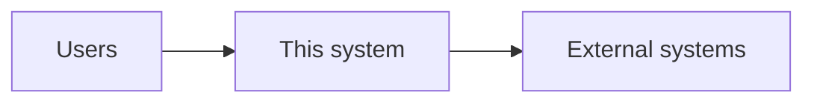

# Architecture

Status: empty

> Brownfield: agent **drafts from code** and marks unknowns `TBD`. Greenfield: user
> fills boxes; agent validates feasibility.

## System context

<!-- FOUNDRY:TBD required="user" prompt="One paragraph: what talks to what externally?" -->

## Runtime components

| component | tech | repo path | notes |
|---|---|---|---|
| | | | |

<!-- FOUNDRY:TBD required="agent" prompt="Inventory from code or user stack choices." -->

## Data stores & messaging

| store | purpose |
|---|---|
| | |

## Deployment shape

<!-- FOUNDRY:TBD required="user" prompt="Monolith, compose, k8s, serverless? Environments?" -->

## Key technical decisions

| decision | choice | rationale |
|---|---|---|
| | | |
